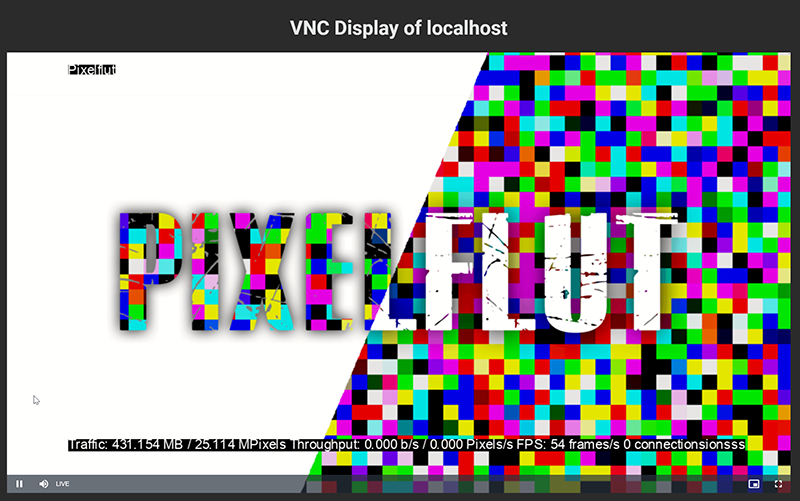

# VNC2HTML5-Viewer

This project connects itself to a VNC server and transferes the remote display to an web page with an video player.

## Usage

The docker image will connect to the given VNC server with the `VNC_HOST`, `VNC_PORT` and `VNC_PASSWORD` environment variables.
For getting all the paths right the `PLAYER_ROOT` variable must be set to the domain where the page will be available afterwards.
To customize the webpage title the `TITLE` environment variable can be set.

The image is available only with the `latest` tag under `ghcr.io/poeschl/vnc2html`. 

For quality of live a docker-compose file is provided in the repository.
If the VNC server is on the same host as the docker container, change the docker-compose to use `network: host`.

## Custom webpage

To customize the webpage map the `/www` folder to the outside and put your own `index.html`, styles and images there.
Just note, mapping will not copy the defaults to your folder outside. As defaults use the files from this repository.
